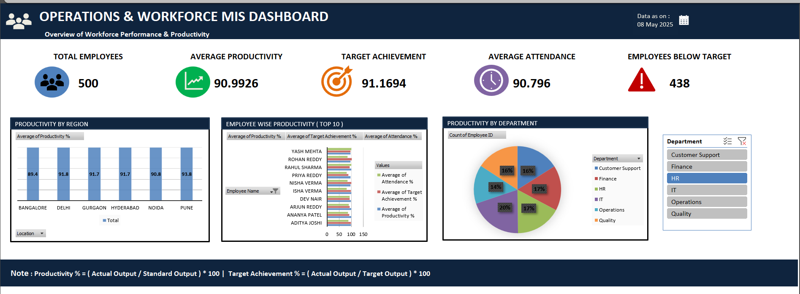

# Operations & Workforce Performance Dashboard

## 📊 Project Overview

An interactive Excel dashboard designed to analyze workforce performance and operational efficiency across different departments.

The dashboard brings together employee productivity, attendance, target achievement, and department-level performance into a single interactive view.

## 🎯 Project Objectives

* Monitor overall workforce performance
* Analyze attendance across departments
* Identify high-performing employees
* Compare employee productivity with targets
* Track department-wise performance
* Present key operational metrics through an interactive dashboard

## 🛠️ Tools & Techniques Used

* Microsoft Excel
* Pivot Tables
* Pivot Charts
* Slicers
* XLOOKUP
* SUMIF
* COUNTIF
* AVERAGE
* MAX & MIN
* Conditional Formatting
* Data Cleaning & Analysis

## 📈 Dashboard Features

### KPI Metrics

The dashboard provides a quick overview of important workforce metrics such as:

* Average Attendance
* Productivity
* Target Achievement
* Employee Performance

### Department Analysis

A department-wise analysis is provided to compare workforce attendance and performance across different departments.

### Employee Performance

The dashboard includes a Top 10 employee productivity view to identify employees with strong performance.

### Interactive Filtering

Slicers allow users to filter the dashboard by department and analyze specific areas of the workforce.

## 🔍 Key Analysis

The project focuses on answering questions such as:

* Which departments have the highest attendance?
* Which employees have the highest productivity?
* How well are employees achieving their targets?
* How does workforce performance vary across departments?
* Which areas may require further operational attention?

## 📷 Dashboard Preview

## 📁 Project Files

* `Operations_Workforce_Dashboard.xlsm` — Excel dashboard and analysis
* `OperationsMIS_Dashboard.png` — Dashboard preview

## 💡 Skills Demonstrated

This project demonstrates practical skills in:

* Data analysis
* Excel dashboard development
* KPI reporting
* Workforce analytics
* Data visualization
* Pivot-based analysis
* Interactive reporting

## 👩‍💻 Author

**Roshni Boral**

BCA — Data Analytics

